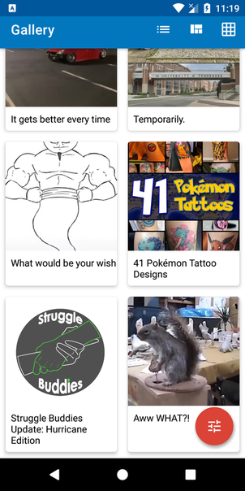
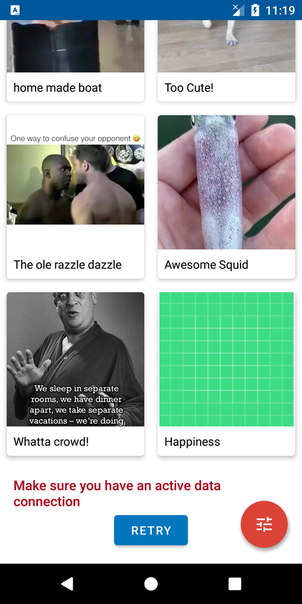
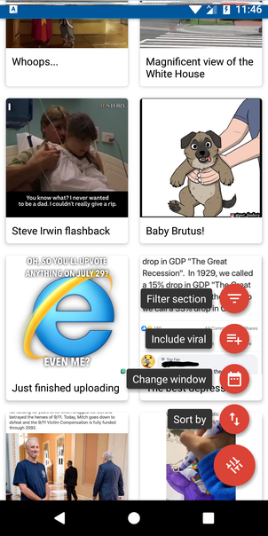

# Gallery
An android client for Imgur API that presents a modern, 2020 approach to Android application 
development with up to date tech-stack.

## Features
* Show Gallery images in a grid view
* Show image title & description over the image, bottom-aligned
* Cache images in both memory and disk
* Allow selecting the gallery section section: hot, top, user, include/exclude viral images from the result set
* When clicking an image in the gallery - show its details: big image, title, description, upvotes, downvotes, and score.
* Allow switching between list/grid/ staggered grid view
* Allow specifying window and sort parameters
* Hide/show the action bar when scrolling the list
* Handle screen orientation change

## Tech-stack
Min API level is set to [`21`](https://android-arsenal.com/api?level=21), so the presented approach is suitable for over
85% of devices running Android.

* [Kotlin](https://kotlinlang.org/) + [Coroutines](https://developer.android.com/kotlin/coroutines) for performing background operations   
* [Hilt](https://dagger.dev/hilt/) for dependency injection
* [Paging 3](https://developer.android.com/topic/libraries/architecture/paging/v3-overview) for infinte scroll
* [Jetpack](https://developer.android.com/jetpack)
    * [Navigation](https://developer.android.com/topic/libraries/architecture/navigation/) for in-App navigation
    * [LiveData](https://developer.android.com/topic/libraries/architecture/livedata) for notifying views about data change
    * [Lifecycle](https://developer.android.com/topic/libraries/architecture/lifecycle) for performing an action when lifecycle state changes
    * [ViewModel](https://developer.android.com/topic/libraries/architecture/viewmodel) for storing and managing UI-related data in a lifecycle conscious way
* [Retrofit](https://square.github.io/retrofit/) for REST API communication
* [OkHttp](https://square.github.io/okhttp/) for http & logging
* [Glide](https://bumptech.github.io/glide/) for image loading and caching
* [Moshi](https://github.com/square/moshi) for parsing JSON into Java objects
* [Lottie](https://airbnb.design/lottie/) for animations
* [Timber](https://github.com/JakeWharton/timber) for logging
* [FloatingActionButton](https://github.com/Clans/FloatingActionButton) for promoted actions
* Tests
    * [Unit Tests](https://en.wikipedia.org/wiki/Unit_testing) ([JUnit](https://junit.org/junit4/)) for writing repeatable tests
    * [MockK](https://mockk.io/) for mocking inside the Unit Test

## Architecture
Application is built on top of MVVM model and Clean Architecture. The code is written in Kotlin.
The goal is to present modern Android application architecture that is modular, scalable, maintainable and testable.

#### Presentation layer
This layer is closest to what the user sees on the screen. The `presentation` layer follows MVVM architecture.

#### Domain layer
This is the core layer of the application. Notice that the `domain` layer is independent of any other layers. 
This allows to make domain models and business logic independent from other layers.

Components:
- **UseCase** - contains business logic
- **DomainModel** - defies the core structure of the data that will be used within the application. This is the source of truth for application data.
- **Repository interface** - required to keep the `domain` layer independent from the `data layer`

#### Data layer
Manages application data and exposes these data sources as repositories to the `domain` layer. 
Typical responsibilities of this layer would be to retrieve data from the internet and optionally cache this data locally.

Components:
- **Repository** is exposing data to the `domain` layer. Depending on application structure and quality of the external APIs repository can also merge, filter, and transform the data. The intention of
these operations is to create high-quality data source for the `domain` layer, not to perform any business logic (`domain` layer `use case` responsibility).

- **RetrofitService** - defines a set of API endpoints.
- **DataModel** - defines the structure of the data retrieved from the network and contains annotations, so Retrofit (Moshi) understands how to parse this network data (XML, JSON, Binary...) this data into objects.

## External dependencies
All the external dependencies (external libraries) are defined in the single place - **config.gradle**.

## Build
You need to register the App on [Imgur](https://api.imgur.com/oauth2/addclient). After registering
you'll get a **Client ID** and a **Client Secret Key**.

Create a file named **secrets.properties** in root folder and copy the below in
```
CLIENT_ID = "xxxxxxx..."
CLIENT_SECRET = "xxxxxxxxxxx..."
```
and replace the xxxx with the Client ID and the Client Secret Key you got from registering at [Imgur](https://api.imgur.com/oauth2/addclient).

### Design decisions
* Architecture - MVVM separates your view (i.e. Activitys and Fragments) from your business logic. 
MVVM is enough for small projects, but when your codebase becomes huge, your ViewModels start bloating. 
Separating responsibilities becomes hard. MVVM with Clean Architecture is pretty good in such cases. 
It goes one step further in separating the responsibilities of your code base. It clearly abstracts 
the logic of the actions that can be performed in your app.

* Caching - Glide checks multiple layers of caches before starting a new request for an image. 
It first checks to see if the resource is in memory and if so, return the image immediately. In the second step it checks to see if the image is on disk and return quickly, but asynchronously.
If above steps fail to find the image, then Glide will go back to the original source to retrieve the data (the original File, Uri, Url etc).

* Infinite loading & Error states handling - The Paging library helps you load and display pages of data from a larger dataset from local storage or over network and provides below features:
    * In-memory caching for your paged data. 
    * Configurable RecyclerView adapters that automatically request data as the user scrolls toward the end of the loaded data.
    * Built-in support for error handling, including refresh and retry capabilities.

* Scroll behavior - CollapsingToolbarLayout is a wrapper for Toolbar which implements a collapsing app bar.

* Orientation change - The ViewModel class allows data to survive configuration changes such as screen rotations.

* Sorting & filtering - FloatingActionButton hovers over content to promote a primary action in the application. 

* Switching between list/grid/staggered grid view - By changing the LayoutManager a RecyclerView can be used to implement a standard vertically scrolling list, a uniform grid, staggered grids, horizontally scrolling collections and more.

## Inspiration
This is project is a case study for Android Developer position at Eurowings Digital. The case study was completed in approximately 8 hours.

## Screens






